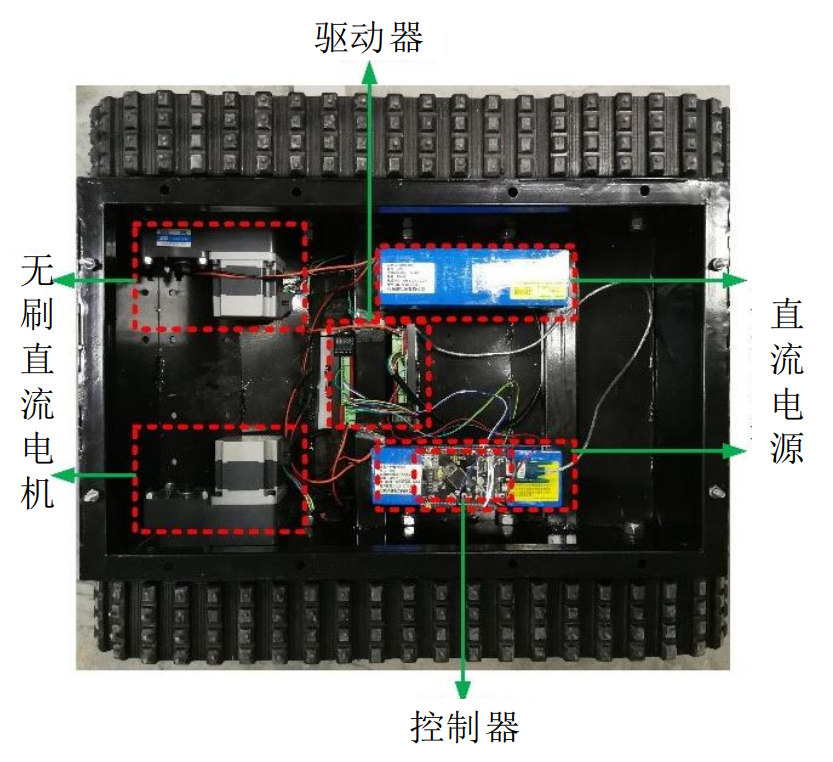

# OrchardRoverFirmWare
OrchardRover 是一套基于 ROS 编写的果园移动机器人 SLAM 系统 (https://github.com/1344618323/OrchardRover)

OrchardRoverFirmWare 是机器人的下位机程序，在 STM32F103ZETx 系列芯片上运行。下位机程序主要用于接收上位机或遥控器的指令，控制底盘移动；同时，还需要解算 里程计数据 提供给上位机的 SLAM 算法

机器人底盘

机器人左右两边各有一个直流电机和控制器

软件环境
* IDE : MDK-ARM V5
* package version: STM32Cube FW_F1 V1.8.0
* FreeRTOS version: 10.0.1
* CMSIS-RTOS version: 1.02

## App文件夹（应用层）
主板主要执行三个任务

1. 机器人移动任务 ：driver_task.c/h
2. 里程计数据解算任务 ：encoder_task.c/h
3. 遥控器数据处理任务 ：remote_receive_task.c/h

## Bsp文件夹（驱动层）
1. 串口驱动 ：bsp_uart.c/h
2. 通讯数据的打包与校核 : protocol.c/h

    PC 与 STM32 通过串口交互数据，我们设计了一套安全的通讯协议，滤除出错的数据，数据包格式如下：
    
    帧头 --> pack_len (数据包长度) --> data_id (数据id) --> data_content (传输内容) --> CRC32 冗余校验

3. 直流电机驱动 ：stepper_motor_con.c/h